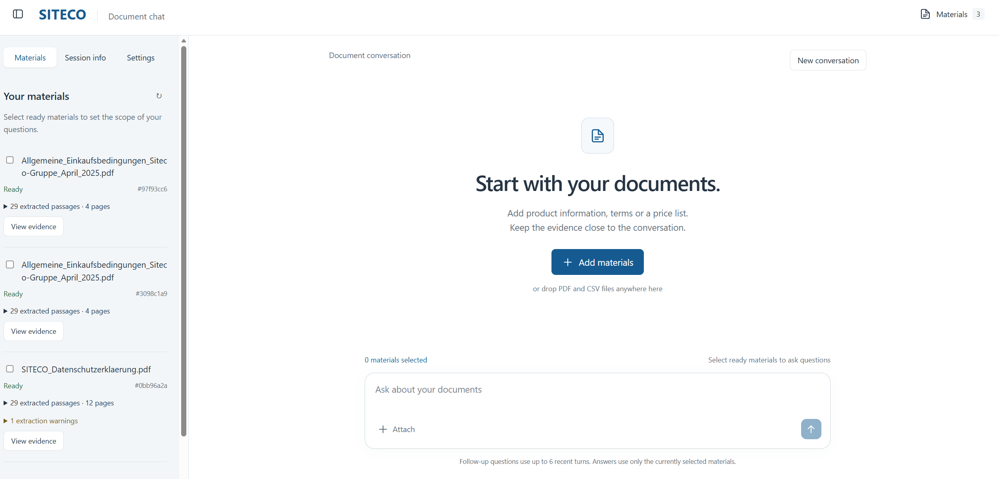
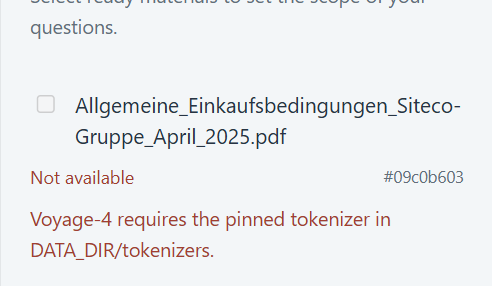

# SITECO Document Chat

## 1. Demo

Upload documents, ask questions, and inspect the sources behind each answer.
The demo combines a React chat interface with a FastAPI retrieval backend.
The demo now supports pdf and csv files. 
All evaluation data comes from https://www.siteco.de/metanavigation/downloads

[](siteco_demo.mp4)

[Watch the demo (MP4)](siteco_demo.mp4). The video is stored with Git LFS; to download it after cloning, install Git LFS and run `git lfs pull`. Sample PDF and CSV documents used in testing are included in [test_data/](test_data/); upload them through the application to try it yourself.

## 2. Repository structure

Main folders and selected entry points:

```text
.
|-- backend/
|   |-- app/
|   |   |-- main.py                    FastAPI entry point and HTTP routes
|   |   |-- uploads.py, documents.py   Upload handling and document lifecycle
|   |   |-- processing.py             Ingestion jobs and index publication
|   |   |-- parsing.py, pdf_layout.py  PDF text extraction and chunking
|   |   |-- csv_parsing.py             CSV record parsing
|   |   |-- pdf_store.py, csv_store.py Document indexes and record storage
|   |   |-- retrieval/                PDF search, lexical ranking and RRF fusion
|   |   |-- embeddings.py, voyage.py  Embedding provider integration
|   |   |-- reranking.py              Optional result reranking
|   |   |-- questions.py, answers.py  Question routing and grounded answers
|   |   |-- question_tasks.py         Asynchronous question execution
|   |   |-- memory.py, generation.py  Conversation context and model calls
|   |   |-- previews.py              Source preview data
|   |   |-- config.py, runtime_*.py   Configuration and runtime service wiring
|   |   `-- services/                Request tracing and summary statistics
|   |-- tests/                       Backend unit and integration tests
|   |-- requirements*.txt            Python dependencies and lock files
|   `-- Dockerfile
|-- frontend/
|   |-- src/
|   |   |-- App.tsx, ChatThread.tsx    Workspace and chat interface
|   |   |-- EvidencePanel.tsx         Retrieved evidence display
|   |   |-- SourcePreview.tsx         PDF highlights and CSV record previews
|   |   |-- SettingsPanel.tsx         Model and retrieval settings
|   |   |-- api.ts, useChat.ts        API client and chat state
|   |   `-- style.css                Interface styling
|   |-- tests/                       Playwright browser and integration tests
|   |-- package.json                 Frontend dependencies and commands
|   |-- vite.config.ts, nginx.conf   Development and Docker proxy settings
|   `-- Dockerfile
|-- eval/
|   |-- cases/                       Evaluation questions and protocol data
|   |-- results/
|   |   `-- m50/
|   |       `-- run-20260927-ab-01/   Published protocol, traces, scores and reports
|   |-- run_m50.py                   Evaluation runner
|   |-- summarize_m50.py             Offline scoring and report generation
|   |-- material_manifest.json       Evaluation document inventory
|   `-- README.md                    Evaluation and reproduction instructions
|-- assets/                          README screenshots
|-- scripts/                         Tokenizer preparation utility
|-- tests/                           Request tracing tests
|-- test_data/                       Sample PDF and CSV documents for manual testing
|-- siteco_demo.mp4                  Recorded application demo
|-- compose.yaml                     Docker services and persistent storage
|-- .env.example                     Environment variables and API key template
|-- pytest.ini                       Python test configuration
`-- README.md
```

## 3. Run the application

Run commands from the repository root. Copy `.env.example` to `.env` and configure:

- `GEMINI_API_KEY`: required for the default Gemini model.
- `VOYAGE_API_KEY`: required for PDF embedding and retrieval.
- `GROQ_API_KEY`: required only when choosing Groq.
- `GENERATION_PROVIDER`: `gemini` (default) or `groq`.
- `GEMINI_GENERATION_MODEL` / `GROQ_GENERATION_MODEL`: model selection.
- `DATA_DIR`: local runtime directory; default `data/runtime`.
- `HOST_DATA_DIR`: Docker runtime directory; default `./data/runtime`.
- `HOST_PORT` / `FRONTEND_PORT`: Docker ports; defaults `8000` / `8080`.

Additional settings and defaults are in `.env.example`. Keep API keys local.

### Local startup

Requires Python 3.12 and Node.js 24. PowerShell:

```powershell
py -3.12 -m venv backend/.venv
backend/.venv/Scripts/python.exe -m pip install -r backend/requirements.lock.txt
backend/.venv/Scripts/python.exe scripts/prepare_voyage_tokenizer.py data/runtime/tokenizers
backend/.venv/Scripts/python.exe -m uvicorn app.main:create_app --factory --app-dir backend --host 127.0.0.1 --port 8000
```

In a second terminal:

```powershell
npm ci --prefix frontend
npm run dev --prefix frontend
```

Open **http://127.0.0.1:5173**. If you change `DATA_DIR`, use its `tokenizers`
subdirectory in the preparation command.

### Docker startup

Requires Docker with Linux containers:

```sh
docker compose build
docker compose run --rm --no-deps backend python -m app.prepare_tokenizer /app/runtime/tokenizers
docker compose up -d --wait --wait-timeout 60
```

Open **http://127.0.0.1:8080**. Stop with `docker compose down`.

### Database path mismatches in environment configuration

The implementation persists documents, indexes and question/answer results in the database.

1. The frontend stores the current conversation reference in `sessionStorage`.
2. Conversations expire after 24 hours.
3. Restarting the backend interrupts unfinished questions but does not intentionally clear completed question/answer records.

During manual testing from a fresh clone, history was reported missing after restarting the application. Differences in the database paths configured through `DATA_DIR` and `HOST_DATA_DIR` may be involved; the cause has not yet been confirmed.

**Voyage tokenizer path mismatch.** If you see “Voyage-4 requires the pinned tokenizer in DATA_DIR/tokenizers,” check the runtime path configured in `.env` and the tokenizer's actual location. The tokenizer must be at `<DATA_DIR>/tokenizers/voyage-4-tokenizer.json`. During one local setup, the author downloaded it under `data/local-e2e/tokenizers/` while `DATA_DIR` still pointed to `data/runtime`. Align these paths and restart the backend. For Docker, prepare the tokenizer in the runtime directory mounted from `HOST_DATA_DIR`.



## 4. Implemented features

- PDF/CSV upload with processing status.
- Text-PDF hybrid retrieval and exact order lookup in SITECO price-list CSVs.
- Questions across selected documents and follow-up conversation memory.
- Source citations, original PDF page highlighting and CSV record previews.
- Gemini/Groq configuration, adjustable Top K and optional Voyage reranking.

Current limitations:

- Cross-document comparison and retrieval have not been optimized; searching across multiple documents may introduce additional noise.
- CSVs currently support only exact order-number lookups. Semantic queries and queries about information absent from the CSV may lead to a loss of conversational context.

## 5. Evaluation

First evaluation: 12 conversation turns and 7 PDF retrieval queries.

- Strict answer pass: **3/12**; required-fact coverage: **10/40**.
- Evidence recall: lexical **9/12**, vector **12/12**, RRF **10/12**, reranked **11/12**.

Results include provider failures and blocked turns. The later order-ID punctuation
fix is locally tested; these scores remain the original pre-fix results.

Open the [report](eval/results/m50/run-20260927-ab-01/report.html) locally, or read
its [Markdown version](eval/results/m50/run-20260927-ab-01/report.md).

Recompute saved scores without API calls:

```sh
python eval/summarize_m50.py eval/results/m50/run-20260927-ab-01
```

For a live evaluation, use the recorded evaluation commit, matching source
materials and your own Gemini/Voyage keys. Commands and configuration:
[Evaluation README](eval/README.md).

## 6. Technical choices and rationale

1. **Scope driven by real documents.** We inspected SITECO materials and focused
   on finding clauses, comparing product specifications, and looking up order prices.
   For image-heavy brochure PDFs, we implemented skipping of image-only pages and
   pages that fail parsing, returning limited retrieval results with explicit
   coverage warnings when information is incomplete. Building on this handling,
   we further optimized the text-PDF retrieval baseline and added simple csv retrieval
   within the two-day scope.

2. **FastAPI, React and Docker Compose.** FastAPI provides typed API validation
   alongside Python's document-processing ecosystem, while React/TypeScript
   supports the upload, conversation and source-viewing interactions. Familiarity
   with this stack reduced implementation risk; two containers retain independent
   frontend/backend builds with a single Compose startup command.

3. **Layout-aware parsing and chunking.** pdfplumber supplies text and coordinates,
   which we group within each page while retaining headings, table headers and
   source locations. Chunks follow complete clauses or table rows, targeting
   roughly 2,400 characters with a 6,000-character ceiling, to keep product
   ownership and qualifying conditions together.

4. **Different retrieval paths for text and records.** PDF retrieval combines
   SQLite FTS5/BM25 and Voyage vectors through RRF, covering literal identifiers
   and semantic matches without calibrating their raw scores. Price-list CSVs use
   exact order lookup to avoid substituting similar products; SQLite and per-document
   FAISS exact indexes keep storage local and document selection explicit.

5. **Hosted models with runtime configuration.** Gemini is the default generation
   path, Groq is a configurable alternative, and Voyage provides embeddings,
   avoiding local model downloads and GPU requirements. Settings accepts the user's
   own keys and inference/retrieval options, with backend calls bound to the
   configuration accepted for each task. The embedding model remains fixed to
   preserve index compatibility.

6. **A chat interface centered on evidence.** The conversation occupies the main
   workspace, with materials and settings in a collapsible sidebar. Expandable
   citations, PDF page highlights and CSV record previews make checking an answer
   part of the normal interaction.

7. **Bounded tasks and focused conversation memory.** Background processing and
   status polling accommodate ingestion and model latency without adding an
   external queue service; documents become queryable after complete index
   publication. Follow-ups use limited history to resolve subjects, then retrieve
   fresh evidence from the selected documents, while supported calculations use
   deterministic tools.

8. **Optional reranking guided by evaluation.** We tested reranking on the same
   candidate sets before exposing it as an optional setting. In the formal small
   evaluation, it increased required-evidence coverage from 10/12 to 11/12 without
   increasing the number of fully covered questions. It remains off by default
   so its coverage benefit can be weighed against another provider call and latency.

## 7. Diagnosed issues and next improvements

### Retrieval coverage

Some prose-PDF evidence is lost during final ranking.

**Possibly involved:** [retrieval/pdf.py](backend/app/retrieval/pdf.py),
[fusion.py](backend/app/retrieval/fusion.py), and
[reranking.py](backend/app/reranking.py).

**Diagnosis:** The necessary evidence is present in the vector results but is not
fully reflected in the final output of the default RRF; therefore, we should first
examine candidate fusion, Top-K, and passage coverage.

### Answer completeness and attribution

Answers can omit conditions or misattribute evidence.

**Possibly involved:** `ANSWER` prompting, evidence organization, and output
verification in [answers.py](backend/app/answers.py).

**Diagnosis:** E01 stems from an incomplete response regarding the qualifying
conditions present in the evidence; E02 additionally involves an error in
attribute attribution. Since the existing prompt already requires the retention
of qualifiers and attribution, simply adding a phrase like "please answer
accurately" may not be effective. Potential approaches include providing
object-by-object responses, ensuring coverage of conditions and exceptions, and
avoiding the mistake of equating "not retrieved" with "not present in the document."

### Provider failures

Provider failures can block follow-up turns.

**Possibly involved:** [generation.py](backend/app/generation.py), `QuestionBudget`
in [questions.py](backend/app/questions.py), and
[question_tasks.py](backend/app/question_tasks.py).

**Diagnosis:** Two failed attempts lasting approximately 60 seconds confirm only
that the call did not succeed; it is not yet possible to determine whether the
cause lies with the network, the SDK, the server, or elsewhere. The first step is
to add robust exception categorization and diagnostic checks for each stage.

### Fixed issue

- **Order-ID punctuation:** Sentence-final periods previously blocked valid order
  IDs. Fixed.

### Runtime and storage improvements

- **Runtime wiring:** Unused imports, legacy test-oriented processing branches and
  redundant startup adapters remain. Simplify service construction and refresh comments.
- **Startup cleanup:** Partial startup failure can leave the ingestion worker
  running. Ensure cleanup also covers failures during service initialization.
- **Retry consistency:** Ingestion retries have a processor-cleanup race and
  database/queue failure windows. Make retry scheduling consistent and recover
  stranded jobs.
- **Storage retention:** Failed uploads remain on disk without a retention limit.
  Add deletion/expiry and a total storage quota.

### Next optimization priorities

1. **Persistence and recovery.** Make the resolved runtime directory visible and
   verify document, index and conversation recovery across restarts. Add durable
   conversation/file history and soft deletion with restoration, keeping database
   records, source files and indexes consistent.
2. **UI readability.** Replace long text-heavy interactions with concise answer
   summaries, comparison views and expandable evidence. Make processing states,
   missing information and recovery actions easy to distinguish.
3. **Cross-document comparison.** Retrieve evidence separately for each requested
   product/document, then align comparable attributes and units before synthesis.
   Track coverage on both sides and explicitly mark missing values.
4. **CSV semantic retrieval.** Add schema-aware matching for descriptive fields
   alongside exact order-number lookup, retaining row-level citations. Ask for
   clarification when matches are ambiguous and distinguish absent fields from
   unmatched records.
5. **Retrieval fusion and ranking.** Evaluate candidate depth, RRF weighting,
   deduplication and reranking on fixed evidence-labeled queries. Measure evidence
   recall and complete-question coverage alongside latency and API cost.
6. **Answer prompting and verification.** Structure evidence by product and check
   each claim for source support, attribute ownership, qualifiers and exceptions.
   Extend verification beyond valid citation IDs, and measure unsupported claims
   and required-fact coverage on the existing evaluation cases.
